# Text: design

Phase 1 of `docs/glyph-reader/PROMPT.md`, for review before any production code. Nothing in the site has changed. The
work sits in the worktree `.claude/worktrees/glyph-text` (branch `glyph-text`, from `origin/main` at v1.4), uncommitted.

Everything below that says "measured" was computed by a scratch prototype (align, vote, emit) on **DEV pages only**
(147 pages, 3,579 loci), following your rule for the held-out pages. Example lines are all from DEV pages. The split
itself appears nowhere in this folder: the Search mock is built from the whole book, and the other mocks show only
totals over a page set.

Contents: [1 What I found](#1-what-i-found-phase-0) · [2 Users and tasks](#2-users-and-tasks) ·
[3 The consensus](#3-the-consensus) · [4 Data](#4-data-files-and-sizes) · [5 Query language](#5-query-language) ·
[6 Screens](#6-screens) · [7 Keys, links, saved work, access](#7-keys-links-saved-work-accessibility-speed) ·
[8 Gold set and benchmarks](#8-gold-set-and-benchmarks) · [9 Against the field](#9-against-the-field) ·
[10 Plan](#10-plan) · [11 Decisions](#11-decisions-i-need-from-you)

---

## 0. In one screen

- **Text is one corpus with three ways in**: a text panel in the Reader, a Search view, and later a Dissect view.
  All three follow the shared place (`POS`). A search hit opens its page in the Reader with the match marked. You can
  step through hits there without going back to the list.
- **The default reading is a consensus**, not anyone's transcription. Up to 13 independent people vote glyph by glyph
  and gap by gap, after their files are aligned in one alphabet. Every other reading stays one tap away, with who read it.
- **Zandbergen has done the hard part**: every file is published in his STA alphabet, with tables to strokes (aaa) and
  back to basic Eva. Text uses those tables, so the comparison does not depend on a mapping we invented.
- **The marks are quiet**. On DEV pages, 63% of lines need no mark at all, 24% one, 8% two and 5% three or more.
  Disagreements where a clear majority agrees are shown only on demand.
- **Licences are clear**. voynich.nu releases its transcriptions under CC0. Stolfi's interlinear may be republished
  with credit, and voynichese.com's word boxes are Apache-2.0. The glyphs are drawn in Glen Claston's public-domain
  font, finished for Text with 89 rare glyphs and kerning (6.1a).
- **Dissect becomes a workbench of nodes** with a fingerprint of the manuscript's known properties, and checks that
  keep experiments honest (6.5).

---

## 1. What I found (Phase 0)

### 1.1 The witnesses

A *witness* here means one person's transcription. A *locus* is IVTFF's unit: one line of a paragraph, one label, or
one ring or spoke of text. ZL has 5,385 loci: 4,130 paragraph lines (P), 1,029 labels (L), 84 rings (C) and 142
radial lines (R).

| Witness | Who, when, from what | Alphabet | Loci (of ZL's 5,385) | Labels / rings / radii | Marks own doubt | Votes? |
|---|---|---|---|---|---|---|
| **ZL** 3b | Zandbergen & Landini, 1998–2025, colour scans | Extended Eva | 5,385 (100%) | all | 2,748 `,` · 817 `[a:o]` | yes |
| **GC** 2a | Glen Claston, 1990s–2000s | v101 (finer than Eva) | 5,366 (99.6%); no f116v, 12 Rosettes loci missing | 1,010 / 84 / 142 | 2,459 `,` | yes |
| **IT** 2a | Takeshi Takahashi, 1998, "solely by referencing the VMs" | basic Eva | 5,214 (96.8%); no Rosettes, no f116v | 882 / 72 / 142 | none | yes |
| **FG** 2a | First Study Group (Friedman), 1944–46, photostats | FSG (coarser) | 4,060 (75%) | 98 / 0 / 0 | 4 `,` | yes |
| **CD** 2a | Currier & D'Imperio, 1970s, photostats | Currier (coarser) | 2,196 (41%) | 21 / 0 / 0 | none | yes |
| LSI **U** | Jorge Stolfi, partial | basic Eva | 1,989 on 123 pages, incl. Rosettes | | `?` only | yes |
| LSI **V** | John Grove, partial | basic Eva | 1,918 on 68 pages, incl. Rosettes | | | yes |
| LSI **T**, **L**, **R**, **X** | Tiltman (1951), Latham, Roe, Mardle | basic Eva | 566, 205, 31, 37 | | | yes |
| LSI **K** + **P** | Kluge, from Petersen's hand copy | basic Eva | 209 labels + 2 | | | yes, as one (Petersen) |
| LSI **N**, **Z** | Landini, Zandbergen (early) | | 28, 7 | | | no: they are ZL's authors |
| LSI **H**, **C**, **F** | = IT, CD, FG | | | | | no: same people |
| LSI **D**, **G**, **I**, **Q**, **M** | second choices unfolded from C, F, J, K, L | | | | | no: shown as those people's alternatives |
| LSI **J** | Reeds, readings of single unreadable glyphs | | 15 lines | | | no: apparatus only |
| **VT** 0e | Takahashi as voynichese.com uses it | basic Eva | 5,206 | | none | **no: a reference row** |
| **RF** 1b | Zandbergen's automatic merge of ZL and GC | Eva + 3 new codes | 5,385 | | 677 `,` | **no: a reference row** |

**Independence.** I checked it two ways. First, provenance: who copied from whom. Second, a measurement: at contested
places, how often does each pair agree with each other against the rest? Landini's lines agree with Takahashi at
**93%** of contested places, against 54–73% for the others. He is also ZL's co-author, so N is excluded. No other
pair stands out beyond what accuracy explains. ZL–GC agree at 74%, ZL–IT at 71% and GC–IT at 66%. FSG–Currier agree
at only 27%, so the two photostat-era files do not share errors.

**How often each one differs from the others** (DEV, at places with at least four voters): ZL 1.0%, GC 1.2%, IT 1.5%,
Currier 2.3%, FSG 3.5%, Stolfi 4.0%, Grove 3.3%, Tiltman 2.8%. A first pass gave GC 7.5%. That was wrong: 93% of it
came from variant forms that only v101 can write and Eva cannot (two kinds of *d*, of *ee*, of plumed *sh*). See 3.2.

### 1.2 voynichese.com on five DEV pages

voynichese.com shows the page photograph with word boxes, but **it never shows the transcription text**. You learn
what it read only by querying, on an on-screen keyboard; typed keys did not work in my test. Its data credits the
Voynich Information Browser (Takahashi via Stolfi). That is close to VT0e but not identical: on f49v it has boxes
for marginal glyphs that VT0e lacks. It has no layout for phones.

I outlined its own word boxes from its per-folio data file, coloured where its word differs from the consensus.
Red means the glyphs differ; amber means the same glyphs with a different word break. The annotations are mine.

| Page | Words | Differ in glyphs | Differ in word breaks only | Doubted gaps it can only show as space or no space | Missing |
|---|---|---|---|---|---|
| f1r | 210 | 20 | 3 | 15 | |
| f57v (rings) | 175 | 43\* | 1 | 77\* | |
| f66r | 347 | 30 | 0 | 16 | 2 labels (f66r.24, .42) |
| f85r1 | 333 | 21 | 11 | 33 | |
| f49v | 162 | 1 | 10 | 9 | 6 labels; its margin glyphs have no text behind them |
| Rosettes (fRos) | none | | | | **all 160 loci** |
| f116v | none | | | | **the page** |

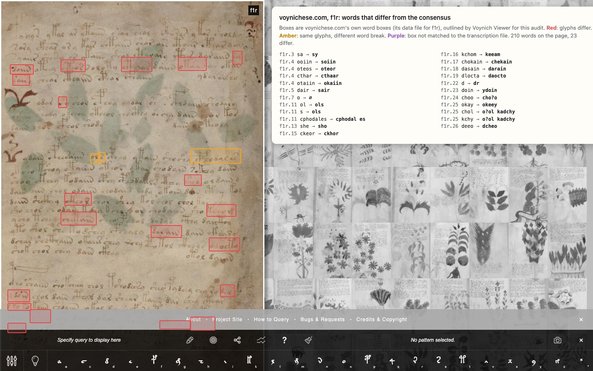
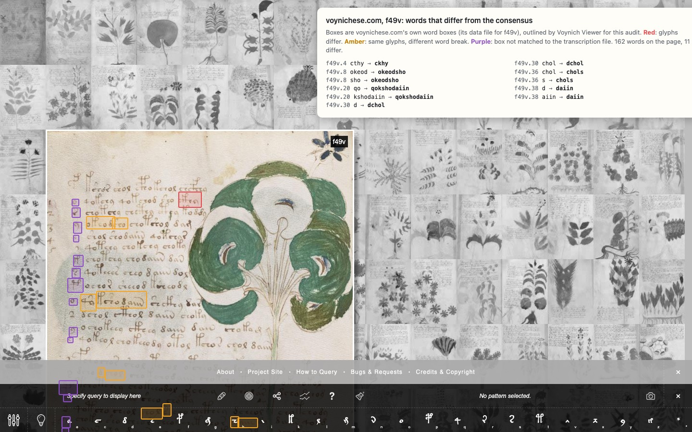

\* f57v's numbers are not yet trustworthy. Its third ring, 17 glyphs repeated four times, uses rare glyphs (`@169;`
to `@172;`) that the prototype wrongly treated as unreadable (see 3.2, step 2). Even so, its rings are where
Takahashi's word breaks differ most from everyone else's ([plain screenshot](text/audit/vc-f57v-plain.jpg)). Across all DEV pages, voynichese.com's text matches the
consensus on **62% of lines and 90% of words**.

### 1.3 The viewer code

- **POS** (`app.js:281`) is written only by `setPos`. Nothing fires an event on a page change, so the text panel will
  hook `Reader.report()`.
- **Hash routes** are `#view/order/at`. A fourth segment is ignored today, so the Reader can take `/text…` without
  breaking any old link. `RETIRED` stays as is.
- **Reader layout** sizes the page from `#rd-stage`'s box, and a `ResizeObserver` re-lays out. A panel beside the stage
  is picked up automatically. Two traps: `toggleGrid` must also hide the panel, and arrows inside the panel turn pages
  unless focus is in a form field.
- **Keys that are free** in the Reader include T, N, I and `/`. In 3D, T already means turn over, so the text keys are
  scoped to the Reader.
- **Your work** exports `{app, version: 1, crops, orders, bookmarks}`. Import never reads `version`, and there is no
  migration code on main.
- **Two surprises.** Main has only two spec files, and they need a missing `fixtures.js`. The full test kit is on
  `origin/test-kit-merged`. The `RETIRED_PANELS` migration the kit expects is there too, not on main.

### 1.4 Licences and credit

| What | Terms | Status |
|---|---|---|
| All transcriptions on voynich.nu, including the STA versions (ZL, GC, IT, VT, CD, FG, RF, LSI, v101) | "made available … in accordance with the Creative Commons CC0 licence"; acknowledgement requested ([roadmap.html](https://www.voynich.nu/roadmap.html)) | **clear** |
| Landini–Stolfi interlinear (Stolfi's page) | free to copy, use, modify and republish, with credit and no added conditions | **clear**; our derived files must carry no extra restrictions |
| bitrans/STA tables | no licence text; the site-wide "freely use … acknowledge the source" applies | clear enough |
| voynichese.com word boxes (XML, 2014) | Apache-2.0 per file; 1,500 px tall frames, crops of older Beinecke scans | **clear**; keep the notice |
| Eva Hand 1 font (Landini) | "specifically permitted for display on this web site [voynich.nu], or for private use" | **not cleared** for us |
| Claston's v101 font, *Voynich 1.23* (Porquet's UTF-8 fix; your download, sha256 `39ba7b1e…2962`) | "courtesy Glenn Claston, 2005, distributed in the public domain" (its own name record) | **clear**; draws v101 codes, so Text converts to them (6.1a) |
| Noto Sans Voy (Zandbergen) | Apache-2.0 as embedded; glyphs in the Private Use Area | possible; glyph origin unverified |
| Yale images | Yale open access policy | already in use |

Credit line, shown as prominently as Yale's and Davis's are today: *Transcriptions by René Zandbergen and Gabriel
Landini, Glen Claston, Takeshi Takahashi, the First Study Group (William Friedman), Prescott Currier and Mary
D'Imperio, Jorge Stolfi, John Grove, John Tiltman, Don Latham, Karl Kluge (from Theodore Petersen's copy), Mike Roe
and Denis Mardle, from René Zandbergen's voynich.nu (CC0) and the Landini–Stolfi interlinear.* voynich.nu notes that
Gabriel Landini died in October 2025. Text credits him as an author of ZL like everyone else, with no special remark
unless you want one.

---

## 2. Users and tasks

Ranked by how often the brief's researchers do the task, and how badly current tools serve it.

1. **Check one reading** (everyone, daily; decipherment claims live or die here). *"Is this word contested? Who read
   it how, and how sure were they? Show me the photograph."* Served by the apparatus card: one tap.
2. **Find a word or pattern across the book** (Ponzi, Knowles, Timm, every forum thread). Search, with whole-word,
   wildcard and position queries, filters, and results in context.
3. **Test whether a pattern is real** (Smith, Feaster, Stafford, Zattera). Counts by scribe, language and section,
   each with its spread across transcriptions. A dispersion strip in any order, and an expected count where honest.
4. **Compare two parts of the text** (Currier A against B, scribes, labels against paragraphs: Lindemann & Bowern,
   Layfield & Davis). Dissect.
5. **Take a reproducible corpus away** (Bowern, Gaskell, Zattera). Export at stated settings, with a URL that rebuilds
   the same selection.
6. **Read a page for the first time** (the curious 15-year-old, and every new forum member). The text panel, Eva
   explained once, and the search box.
7. **Judge the photograph** (Davis, Zandbergen, you). Word boxes, crops and later the glyph atlas. Partly PR 2.
8. **You, with held-out pages**. A saved page set that Search and Dissect respect, so you can stay on DEV.

Ten timed research tasks for the benchmark are in section 8.

---

## 3. The consensus

### 3.1 In plain words

Several people copied the same lines by hand, and they don't always agree. Text lines their copies up glyph by glyph,
lets each person vote, and shows the reading most of them agree on. Where they really split, the text says so with a
quiet mark, and one tap shows who read what. The consensus is a reading, not the text.

### 3.2 Step by step

**1. Inputs.** Zandbergen's STA files for ZL3b, GC2a (level 0), IT2a, FG2a and CD2a; VT0e and RF1b as reference rows.
The interlinear's extra people (U, V, T, L, K+P, R, X) come from `LSI_ivtff_0d.txt`. They are converted to STA with
the rules that turn Zandbergen's Eva IT2a into his STA IT2a. Learned from his two files, those rules reproduce his
conversion on 5,208 of 5,215 lines; the seven misses are rare compound gallows. Every input is pinned by SHA-256.

**2. One alphabet, at the right grain.** In STA every glyph is a family plus a member, for example `A1` *o*, `A3` *a*,
`A2` *y*. Comparing is done at **the finest grain every witness can write**: Zandbergen's "nearest basic Eva"
table (`STA-Eva_Bint.bit`). Finer distinctions (v101's two *d*s, plumes) are kept in the apparatus but do not vote.
Extended Eva's **rare glyphs** (`@nnn;`) are different: basic Eva has no letter for them, but they are not
unreadable. They vote as themselves, and a witness who wrote a basic letter there disagrees. (The prototype treated
them as `?`; on f57v that is visibly wrong, and Phase 2 fixes it with a test on f57v.3.) v101's two in-between glyphs (STA `Aa`, `Ab`, which RF1 writes `@221;` and `@222;`)
vote on their family only: "a circle-type glyph", not *a* or *o*. Witnesses whose alphabet cannot make a distinction
abstain on it, rather than being counted as disagreeing.

**3. Align.** Each line is aligned to ZL, the only witness that covers every locus. The alignment is glyph by glyph,
with costs from Zandbergen's stroke alphabet (aaa). *a*/*o*/*y* or *r*/*s* share a family and cost little; *iin* against
*in* differs by one stroke; *ch* against *ee* is the same three c-strokes with or without a bar. A 2-for-1 match is
allowed only where the strokes match like that, and never across a word break. In Phase 2 the costs will be fitted to
the measured confusions on DEV pages (a↔o 615 times, r↔s 319, …), like a BLAST substitution matrix.

**4. Columns.** A column ends wherever every witness has a glyph boundary. Most columns are one glyph; some are two
or three where the witnesses cut differently (*che* | *eee*).

**5. Vote on glyphs.** One person, one vote. A transcriber's own alternative `[a:o]` splits their vote in half.
An unreadable `?` means present but not voting; a missing line means not a witness. Each column gets one status:

| Status | Rule | DEV share | Shown by default |
|---|---|---|---|
| unanimous | one reading, at least two voters | 91.7% | plain |
| majority | one reading has more than half the votes | 7.2% | plain; marked only in "every disagreement" mode |
| plurality | most votes, but not more than half | 0.3% | **dotted underline** |
| tie | two readings with equal votes | 0.7% | **dotted underline** |
| single witness | only one person covers it | 0.1% | listed in the page facts |
| no witness | everyone has `?` | 0.04% | **?** |

**6. Vote on spaces.** Every gap between columns is voted the same way. A space `.` or drawing break `<->` counts 1,
an uncertain space `,` counts ½, and no space counts 0. *s* is the mean over the people who have glyphs on both sides.

| Status | Rule | DEV share of gaps | Consensus writes | Shown |
|---|---|---|---|---|
| everyone | *s* = 1 | 19.2% | space | space |
| most | *s* ≥ ⅔ | 2.0% | space | space |
| uncertain | ⅓ < *s* < ⅔, **or** two or more people wrote `,` | 1.3% | `,` | **small dot in the gap** |
| doubted | *s* ≤ ⅓, one person wrote `,` | 1.2% | no space | only in "every disagreement" mode |
| few | *s* ≤ ⅓, someone wrote `.` | 0.9% | no space | only in "every disagreement" mode |
| nobody | *s* = 0 | 75.3% | no space | nothing |

The "two commas" rule matters because only ZL and GC ever write `,`. Takahashi, FSG and Currier could not say
"maybe", so they had to choose. When both people who could express doubt did, the gap is uncertain whatever the forced
votes say.

**7. Ties follow a written rule.** A tied column shows the tied reading of the witness that covers most of the
manuscript: ZL, then GC, then IT. It is still marked as a tie, and all readings stay in the card. A space at exactly
*s* = ½ stays uncertain; it is never resolved. Before the gold set is scored, this rule is tested against two others:
"RF1 breaks ties" and "the modern three only" (section 8).

### 3.3 Where this differs from RF1 and from Zattera

- **RF1** (Zandbergen) aligns ZL and GC on aaa and compares them in STA, which is the same machinery. But it has two
  witnesses, its corrections are expert judgments rather than votes, and its stated purpose is a reference with a
  stable ID for every character. It keeps 677 uncertain spaces and no alternatives. Text keeps every reading, counts
  up to 13 people, and states its rule. It uses RF1's character IDs as its own stable IDs.
  *Measured on DEV:* the consensus matches RF1 on 84% of words. 1,212 words differ in glyphs and 1,931 only in word
  breaks, because RF1 resolves almost every doubtful gap. 967 differ only because RF1 adopts v101's in-between glyphs,
  `@221;`/`@222;`.
- **Zattera (2022)** makes any glyph not read identically by everyone unreadable, and splits a word wherever anyone saw
  a space. That throws away the 7% of columns where a clear majority exists, and inflates word counts. Text keeps
  those majorities and splits only where most people do.

### 3.4 Three lines worked through

**A. Easy: f10r.6.** The five native files look nothing alike:

| | native | STA, first word |
|---|---|---|
| ZL | `ycheor.cthy.chor.cthaiin.qoctholy.dy<->chy.taiin.shy` | `A2 K1 J1 A1 C1` |
| GC | `91coy.K9.1oy.Kam.4oKoe9.89.19.kam.29` | `A2 K1 J1 A1 C1` |
| IT | `ycheor.cthy.chor.cthaiin.qoctholy.dy<->chy.taiin.shy` | `A2 K1 J1 A1 C1` |
| FSG | `GTCOR.HZG.TOR.HZAM.4OHZOEG.8G.TG.HAM.SG` | `A2 K1 J1 A1 C1` |
| Currier | `9SCOR.Q9.SOR.QAM.4OQOE9.89.S9.PAM.Z9` | `A2 K1 J1 A1 C1` |

In STA all five are identical, glyph for glyph. After *dy* the plant interrupts the line: ZL and IT write `<->` and
the others a plain space, and both count as a space. Consensus: **`ycheor cthy chor cthaiin qoctholy dy chy taiin shy`**,
every column unanimous, nothing marked.

**B. A contested space and a three-way glyph: f1r.2.** Six people cover it.

```
ZL       sory.ckhar.or,y.kair.chtaiin.shar.ase.cthar.cthar,dan
Claston  soy9.Hay.oy,9.hacy.1kam.2ay.Ais.Kay.Kay.8aN     (v101; in Eva: sory.ckhar.or,y.kaer.chtaiin.shar.ais.cthar.cthar.dan)
IT       sory.ckhar.or.y.kair.chtaiin.shar.are.cthar.cthar.dan
FSG      2ORG.DZAR.ORG.DAIR.THAM.SOR.AR.HZAR.HZAR.8ALA    (in Eva: sory.ckhar.ory.kair.chtaiin.shor.ar.cthar.cthar.dana)
Currier  2OR9.XAR.O.R.9.FAN.ZPAM.ZAR.AR?.QAR.QAR.8AD      (in Eva: sory.ckhar.o.r.y.kain.shtaiin.shar.ar?.cthar.cthar.dan)
Stolfi   sory.ckhar.o!r!y.kair.chtaiin.shor.ary.cthar.cthar.dan?
```

- *or · y*: ZL `,` ½ + Claston `,` ½ + IT `.` 1 + Currier `.` 1 + FSG 0 + Stolfi 0 = 3 / 6 → *s* = 0.50 →
  **uncertain**, shown `or·y`. voynichese.com shows a hard space; RF1 writes `ory`.
- *o · r*: only Currier has a space, *s* = 0.17 → no space, not marked.
- *kair*: `ir` ZL, IT, FSG, Stolfi (4) · `er` Claston · `in` Currier → majority, not marked.
- *shar*: `a` 4 · `o` FSG, Stolfi → majority.
- *are*, second glyph: `r` IT, FSG, Currier, Stolfi (4) · `s` ZL · `i` Claston → majority *r*. Third glyph: `e` ZL, IT
  (2) · `s` Claston · `y` Stolfi · none FSG; Currier's `?` abstains → **plurality** *e*, dotted underline. RF1 reads
  `ais`, following Claston.
- *cthar , dan*: ZL `,` ½, everyone else `.` → *s* = 0.92 → space.

Consensus: **`sory ckhar or,y kair chtaiin shar are cthar cthar dan`**, with two marks. The card for *are* is mocked in
6.2.

**C. Alphabets that cut glyphs differently: f3v.5.**

```
ZL       ychear.otchal.cho,r.char.ckh[a:y]
Claston  91cay.ok1ae.1o,y.1ay.Ho            (in Eva: ychear.otchal.cho,r.char.ckho)
IT       yeeear.otchal.eeor.eear.ckhy
FSG      GCCCAR.OHTAE.CCOR.CCAR.DZG         (in Eva: yeeear.otchal.eeor.eear.ckhy)
Currier  9SCAR.OPSAE.SOR.SAR.X9             (in Eva: ychear.otchal.chor.char.ckhy)
Stolfi   ychear.otchal.chor.chor.ckh!!
```

A letter-by-letter diff of Eva would see *ych-e-ar* against *y-ee-e-ar* as two substitutions. In STA, ZL's
`K1 J1` (*ch*, *e*) faces IT's single `M1` (*eee*). In strokes, `K1` = `c2:c1` and `J1` = `c0`, while `M1` =
`c0~c0~c0`: the same three c-strokes, differing only in whether the first two are joined by a bar. So the aligner
makes one column, *che* | *eee*, and the vote is about that bar: *che* 4 (ZL, Claston, Currier, Stolfi) against *eee*
2 (IT, FSG). The same happens in *chor*/*eeor* and *char*/*eear*: Takahashi and the FSG read the bench as *ee*. At
*cho , r*, ZL and Claston both wrote `,` and the other four nothing (*s* = 0.17). Under the two-comma rule it is
**uncertain**. The last glyph: ZL `[a:y]` gives ½ each, IT, FSG and Currier `y`, Claston `o`, Stolfi unreadable →
*y* 3.5 of 5, majority.

Consensus: **`ychear otchal cho,r char ckhy`**.

A tie, for completeness: on f1r.1, *cthres*. The first column votes `cth` 1.5 (IT, ½ ZL), `oto` ½ (ZL's alternative),
`cto` Claston, `k` FSG and `ctho` Currier. That is a plurality, shown with a dotted underline. RF1 reads `ctoses`.

### 3.5 Known gaps

Text that no transcription has is listed per page, not silently left out. Phase 2 builds `gaps.json` from ZL's own
comments and Davis's multispectral notes, starting with the words under paint on f2r, the margin of f11v, the
UV-only line on f17r, and f1r's marginal alphabet (removed from ZL in 2025). The page facts say "1 known gap".

---

## 4. Data files and sizes

Built offline by `tools/text/` (Python, like `tools/seams.py`), committed as JSON, loaded lazily. Sizes measured on the
DEV prototype and scaled ×1.49 to the whole book.

| File | Loaded | Holds | Raw / gzip (est.) |
|---|---|---|---|
| `data/text/meta.json` | when Text first opens | witnesses, credits, method version, input checksums, page facts, gaps | ~15 KB / 4 KB |
| `data/text/pages/<page>.json` | with that page's text | every locus: consensus, non-unanimous columns and gaps with votes and names, each witness's own line | avg 14 KB / **2.3 KB**, max 51 KB |
| `data/text/index.json` | on first search | consensus text of every locus, with locus ids and page facts | ~300 KB / **93 KB** |
| `data/text/witnesses.json` | when "every transcriber" or a single transcriber is chosen | each voter's text | ~1.4 MB / 250 KB |

One locus in a page file:

```json
{"id":"f1r.2","t":"P0","c":"sory.ckhar.or,y.kair.chtaiin.shar.are.cthar.cthar.dan",
 "u":[[31,1,"m",[["a",4,"ZL GC IT CD"],["o",2,"FG LU"]]],
      [35,1,"m",[["r",4,"IT FG CD LU"],["s",1,"ZL"],["i",1,"GC"]]],
      [36,1,"p",[["e",2,"ZL IT"],["s",1,"GC"],["",1,"FG"],["y",1,"LU"]]], …],
 "s":[[13,"u","ZL, GC, IT. CD. FG LU"], …],
 "w":{"ZL":"sory.ckhar.or,y.kair.chtaiin.shar.ase.cthar.cthar,dan","GC":"…","RF":"…","VT":"…"},
 "n":{"GC":"soy9.Hay.oy,9.hacy.1kam.2ay.Ais.Kay.Kay.8aN"}}
```

`c` is Eva with IVTFF's own `.` and `,`, so it can be copied straight into other tools. Offsets point into `c`. Only
columns and gaps that are not unanimous are stored. `n` keeps native strings for alphabets other than Eva. Stable IDs
are the IVTFF locus (`f1r.2`) and, for a glyph, RF1's page + locus + character index. Nothing is normalised away:
`[a:b]`, `{}`, `?`, `,`, `@nnn;` and `<->` survive in `w`.

**Speed.** A page's text is 2.3 KB gzipped, against about 500 KB for its photograph (f1r). The index (93 KB) parses in well
under a second on a mid-range phone. Queries run in a Web Worker over one concatenated string with locus offsets;
whole-word queries on 300 KB take a few milliseconds. The 50 ms budget leaves room for regex and near matches. The
benchmark runs on a throttled Pixel 7 profile in Playwright.

**Pipeline** (`tools/text/`): `ivtff.py` is copied from `~/voynich/src`, as asked. Then `sta.py` (STA and aaa tables),
`lsi.py` (interlinear → STA), `align.py`, `vote.py` and `build.py`, with tests: the IT round trip ≥ 5,208/5,215, locus
counts by type (P 4,130, L 1,029, C 84, R 142), the three worked lines above as fixtures, and published figures within
their spread. Plus a diff report against VT0e and RF1 (Phase 2).

---

## 5. Query language

Simple things stay simple; each step adds one idea, the way BlackLab's search modes grow. Eva is lowercase only, so
capitals, brackets and symbols are free for syntax.

| You type | Means | Echoed back as |
|---|---|---|
| `qokeedy` | the whole word | "the word **qokeedy**" |
| `chol daiin` | two words in a row, with a break between | "**chol** then **daiin**, as separate words" |
| `qok*` | words beginning qok (`*` = any run of glyphs in a word) | "words that **begin with qok**" |
| `*dy` / `*ke*` | ending / containing | "words that **end with dy**" |
| `ch?dy` | one glyph in place of `?` | "**ch**, any one glyph, **dy**" |
| `[kt]eedy` | either glyph | "**k or t**, then eedy" |
| `<gallows>edy` | a named class: `<gallows>` k t p f, `<bench>` ch sh, `<pedestal>` ckh cth cph cfh, `<loop>` o a y, `<unread>` | "a **gallows**, then edy" |
| `dy-qo` | inside one word | "**dy** and **qo** joined, no break" |
| `dy_qo` | across a word break | "**dy** at a word's end, **qo** starting the next" |
| `dy~qo` | either (Oracc's joiners) | "**dy** then **qo**, joined or not" |
| `chol~daiin` | finds *choldaiin*, *chol daiin* and *chol,daiin* | "chol and daiin, **however the transcribers split them**" |
| `^qo*` / `*dy$` | first / last word of a line | "…, **first in a line**" |
| `A A` | the same word twice in a row (a capital stands for "some word") | "**any word repeated**" |
| `A:qok* … A within:3lines` | a repeat within three lines | "a qok- word **repeated within 3 lines**" |
| `/qo[kt]e+dy/` | a regular expression over the glyph stream (`.` space, `,` uncertain space) | "**regular expression** qo[kt]e+dy" |
| `scribe:2 lang:B section:balneo quire:13 in:label at:para-start page:f75r-f84v set:mine` | filters as qualifiers (GitHub style) | appended in plain words |

Settings, as pills under the box (each also in the URL):

- **Reading**: consensus (default), one transcriber, or **every transcriber**. With every transcriber, a hit counts if
  anyone reads it so, and each result says "in 3 of 5".
- **Spaces**: as transcribed · ignored (one stream of glyphs) · uncertain either way (default). The same switch drives
  counts: an uncertain space as a space, as no space, or as half (Stolfi).
- **Match**: exact Eva · ignore plumes · Stolfi's merges (g = m, u = n) · STA family. One line under the pill says
  what is merged.
- **Near**: off · 1 · 2 edits, with costs from the measured confusions (a/o cheap).
- **Pages**: the whole book, or a saved page set (your DEV set lives here, stored only in your browser).

A **glyph palette** (the "Glyphs" button) shows each glyph's image with its Eva letter. Clicking one inserts it, as in
the Thesaurus Linguae Aegyptiae, so nobody has to learn Eva first. Classes are at the bottom of the palette.

**Is this surprising?** An expected count is shown only where an honest model exists. For a sequence across a break
(`dy_qo`), it is how often the end and the start occur, multiplied, as if neighbouring words were independent. For a
narrowed count (`qok*` in scribe 2), it is the rate everywhere else times the narrowed size. For single words nothing
is shown: frequency is the answer.

---

## 6. Screens

All mocks are rendered HTML (`docs/text/mocks/index.html?s=…&theme=…`), using real DEV data and the site's tokens.
Every screen is at 1440 and 375 px, light and dark, in `docs/text/mocks/shots/`. The site has no dark mode today; the
dark set is proposed tokens for the chrome. The Reader's panel uses the Reader's dark "table" in both, like the 3D
inspector.

### 6.1 Reader text layer

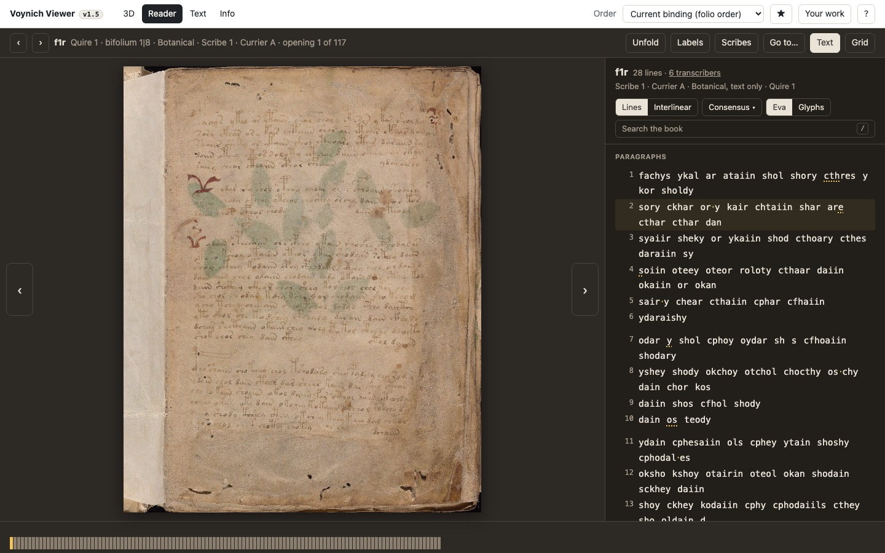

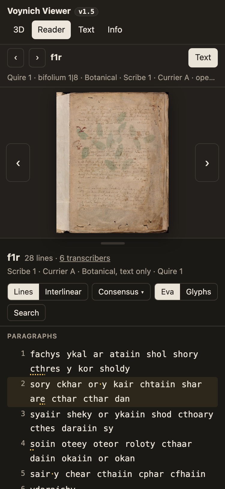

- A **Text** button in the Reader bar (key T) opens the panel: right of the page on desktop (456 px), below it on a
  phone with a drag handle. The page shrinks to fit, through the existing `ResizeObserver`.
- **Header**: page, line count, "6 transcribers" (a link listing who covers this page), and one line of facts in
  the Reader bar's own words: *Scribe 1 · Currier A · Botanical, text only · Quire 1*. When an opening shows two
  pages, each page's text gets its own header.
- **Layout says the locus type**, said once: paragraphs as indented blocks, then *Labels* as a two-column list in
  page order, then *Rings* and *Radii* each under one heading. There is no badge on any row. Line numbers in the
  gutter are the IVTFF locus (f1r.2 on hover, focus and copy).
- **Marks**: a dotted gold underline where the glyph vote is split, and a small gold dot in an uncertain gap. A
  display menu offers *Marks: quiet (default) · every disagreement · none*.
- **Credits** close the text, at the end of the scroll.
- **Reading switch**: Consensus ▾ lists every transcriber present, then RF1 and voynichese.com as references. The
  marks follow the chosen reading's disagreements with the consensus.
- **Any word leads on**: click a word for its card, with occurrences (for example *shar*: 31 on DEV pages, with its range),
  a link to Search, and the other occurrences on this page highlighted.
- **Eva or glyphs**: a toggle in the panel header (6.1a).

### 6.1a Glyphs: Claston's font, finished for Text

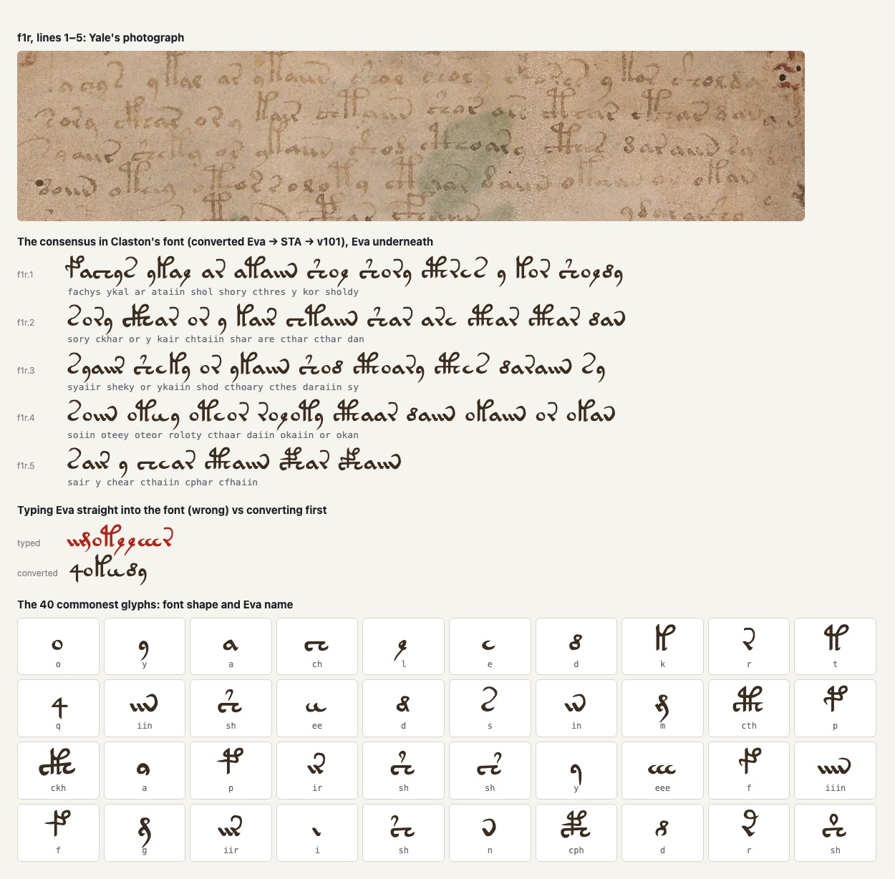

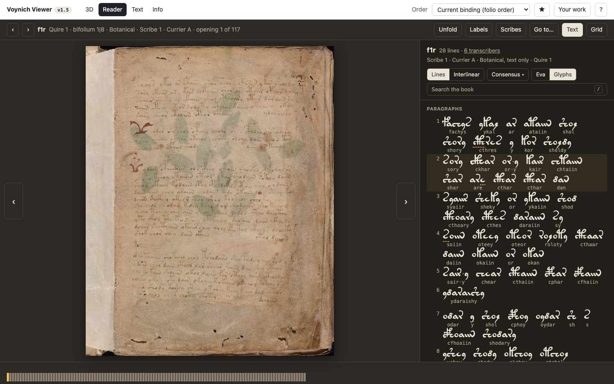

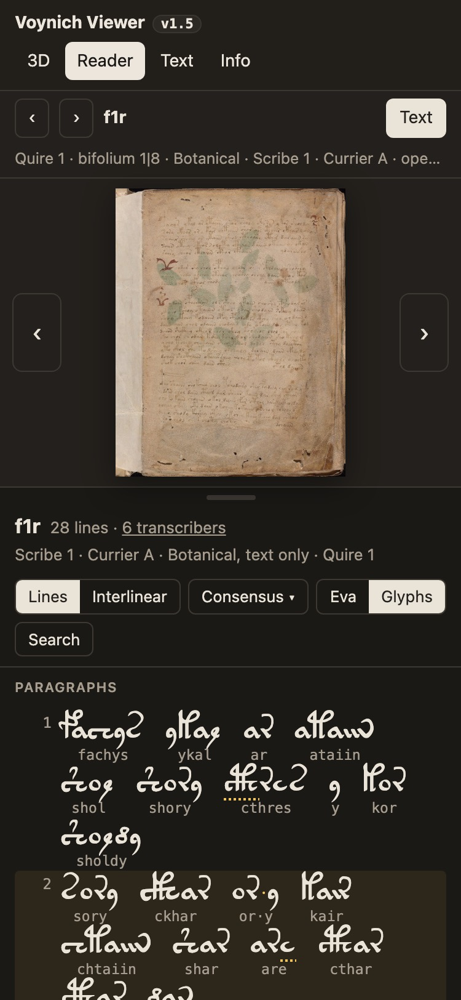

The font is Glen Claston's *Voynich 1.23* (2005, public domain; UTF-8 fix by William Porquet). Your download is
byte-for-byte the file on Font Library (sha256 `39ba7b1e…2962`). `tools/font/build_font.py` turns it into
**Voynich VV** (`assets/fonts/voynich-vv.woff2`, 41.5 KB, loaded only in glyph mode), and writes
`data/text/glyphs.json`, which says which character draws each of the 299 STA glyphs.

- **Claston drew v101, not Eva**, so Text converts each glyph through STA. The table comes from Claston's own
  transcription against its STA version (161 characters, all one-to-one). Rare glyphs he never used come from the v101
  column of Zandbergen's STA definition, and variants from Zandbergen's reduction table. One correction to the first
  pass: Eva *ee* is two separate glyphs, which v101 writes `cc`; Claston's `C` is a different, joined form.
- **89 glyphs added** for the rare forms the transcriptions use but the font lacked. Each has its own character
  (U+E100 onwards), made only from Claston's shapes, judged against the pictures in Zandbergen's STA definition and
  the photographs. Nothing is copied from Landini's restricted font. In `glyphs.json` each says how good it is:
  - **11 Claston drew**: his rare characters (*oy*, `@156;`) or two side by side (*iiir* = `iii`+`r`);
  - **31 joined** from his parts, placed so their strokes meet: *oh*, *ih*, *cy*, *ai*, *chh*, *c'a*, *cp*, *if*,
    *ckhy*, *cthy*, *ckhhh*…;
  - **44 drawn** for the rarest forms (1–14 times in the whole manuscript), in `tools/font/draw.py`. Each is cut and
    joined from Claston's own outlines with boolean geometry: a gallows leg with its pointed head, the loop of *l* on a
    stem, *k*'s loop scaled down, the plume of *sh*, a bench without its first *c*. The parts are set the way
    Zandbergen's stroke alphabet and his pictures describe the form (bench + stem for *Ta*, *cph* begun with *o* for
    *To*, *cth* with a plume for *Ud*, a dot for the first *c* in *Uo*, and so on);
  - **4 illegible**: the symbols ending f68r2's ring, which nobody can read, shown as the unreadable mark.
- **Kerning, 47 pairs.** Claston spaced each glyph by its widest part. The gallows *p* and *f* overhang the next glyph
  with their loop, so in the font the next glyph started a whole loop away; in the manuscript it tucks in under. Those
  pairs now close up (*pch*, the commonest, by 18% of an em), never nearer than 5% of an em at any height. A few
  colliding pairs (*r* or a variant *c* before *p*) are pushed apart. Pairs that merely touch, such as *qo*, are left
  alone. The unreadable mark `?` is never kerned.
- **The review sheet** (`build_font.py --sheet`) shows every added glyph and every kerned pair before and after, with
  some common words. `tools/font/test_font.py` checks that every STA glyph is drawn, that the drawn ones are real outlines, that
  none is approximate any more, that the source is the Font Library file, and that *pch* is kerned.

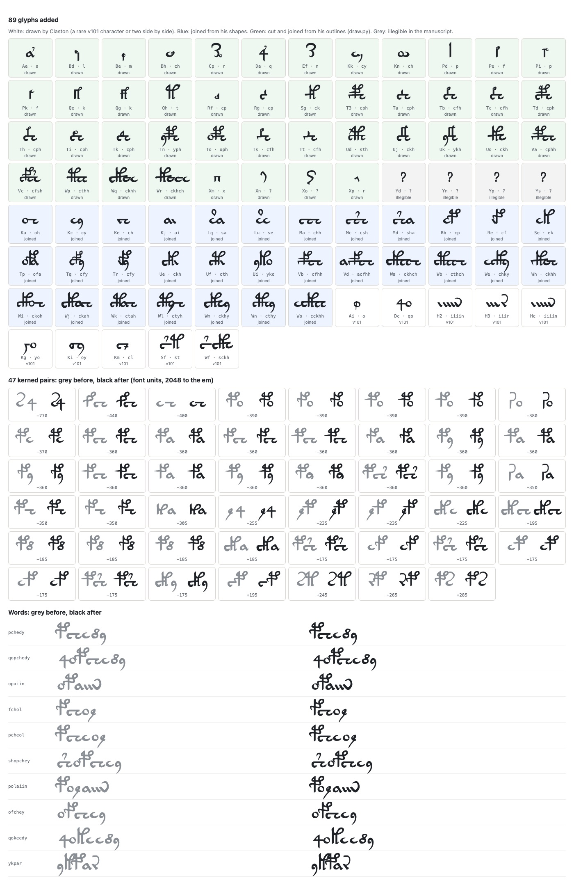

In the Reader, glyph mode shows each word in glyphs with its Eva directly underneath, so the two never drift apart
when lines wrap. Marks stay on the glyphs. Each word carries its Eva as its accessible name; copying gives Eva, and
search works as before. In Claston's own reading, the font also shows the distinctions only v101 makes (two forms of
*a*, *y*, *d*, plumed *sh*).

### 6.2 The apparatus card

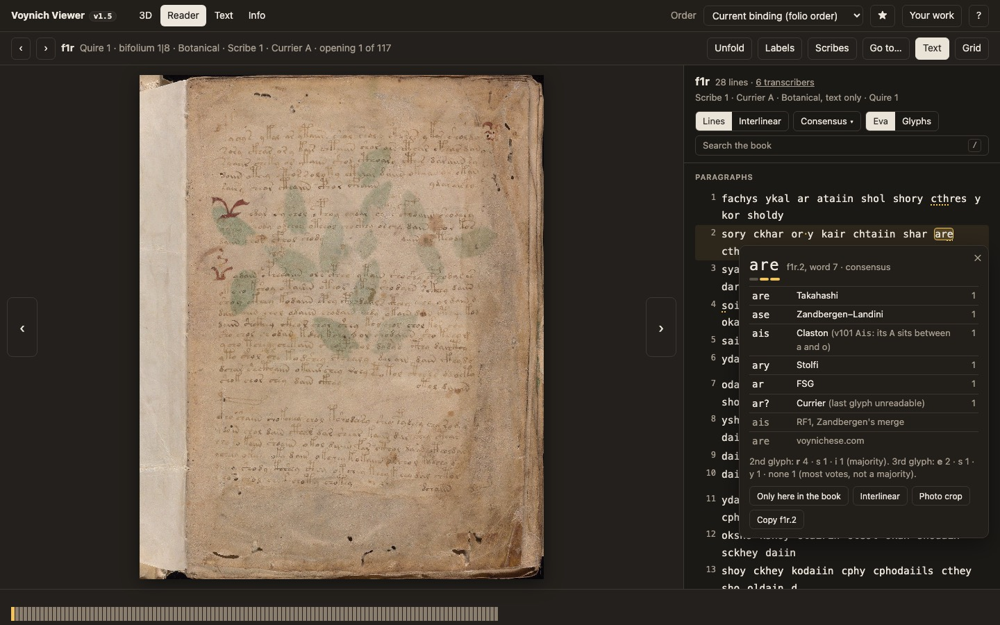

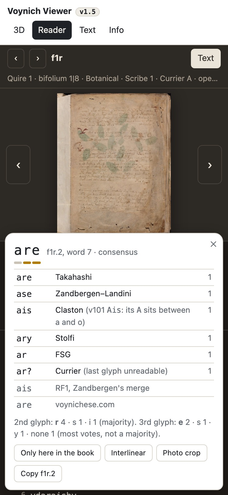

One card, for hover (desktop, after 300 ms, marked words only) or tap and Enter (all words). On a phone it is a bottom
sheet. It shows the word as read by each person, grouped, with their own doubt in plain words. RF1 and voynichese.com
are set apart, in grey, as references. A bar under each glyph shows how many agree; a short line gives the votes.
Actions: other occurrences, open the interlinear at this line, photo crop (PR 2), and copy the locus.

### 6.3 Interlinear

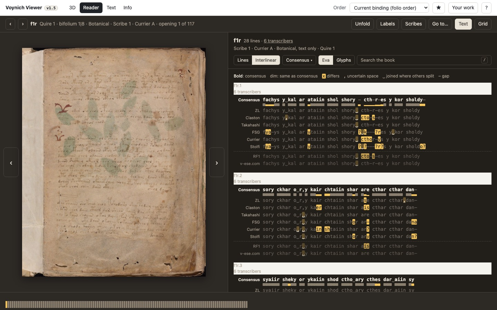

- The panel widens (up to 58% of the screen): this is study mode. Each line is a block, as in Jalview. The consensus
  is in bold with an agreement bar under each column. Below it is one row per transcriber, dim where they agree and
  gold where they differ. `-` is an alignment gap, `,` an uncertain space and `‿` a join where others split. RF1 and
  voynichese.com sit under a dashed rule.
- Rows can be hidden from a legend, like IGV tracks, and remembered. A "collapse unanimous lines" switch shortens long
  pages.
- **N / Shift+N** jump to the next or previous disagreement (any mode), scroll it into view and open its card.
- On a phone each block scrolls sideways, with the names fixed on the left.

### 6.4 Search

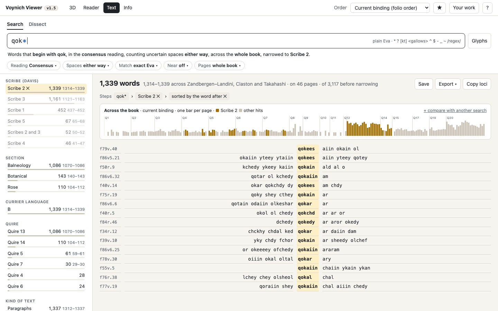

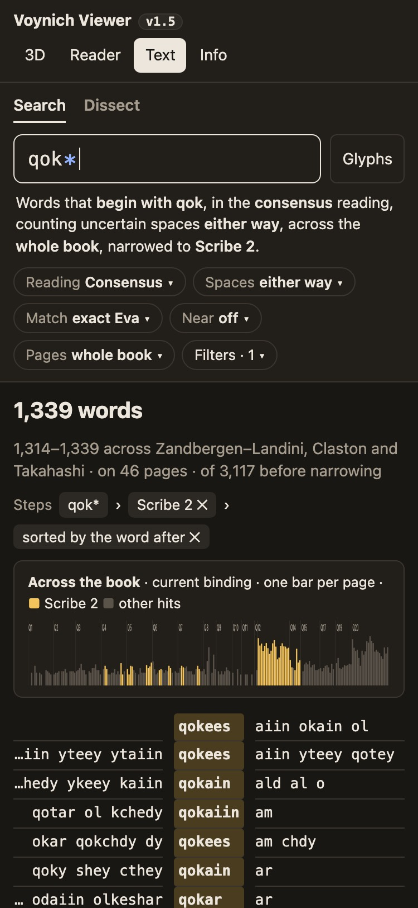

- A new top tab, **Text**, holds Search and (later) Dissect. The box in the Reader's panel, or `/` anywhere, opens it
  with the query.
- **The echo line** says in words what the query means and under which settings. That line answers "why these
  results", as regex101 does.
- **Facets** (left; a "Filters" sheet on a phone) give counts by scribe, section, Currier language, quire and kind of
  text. Each count shows its range across ZL, GC and IT ("826 · 817–826"). Clicking narrows, and the narrowing appears
  as a **step** in a chain you can remove (CQPweb, KonText). The mock shows *qok\** › *Scribe 2* › *sorted by the word
  after*.
- **The book strip** has one bar per page in the order chosen in the Order menu: the binding, Davis's, or your own.
  Height shows hits; gold is the current narrowing and grey the rest. "+ compare with another search" overlays a
  second query in blue. Hovering gives the page; clicking scrolls the results to it.
- **Results**: KWIC with the match centred. In book order (default) they are grouped by page under a thumbnail and the
  page facts. A sort flattens them, as in the mock. Clicking a hit opens the Reader at that page with the line lit and
  a bar: *Result 3 of 826 ‹ › · All results*.
- **Save** puts the search in Your work. **Export**: CSV (locus, page, facts, left, match, right, which witnesses),
  IVTFF of the matching loci, or a list of loci to copy.

### 6.5 Dissect: a workbench of nodes (PR 3)

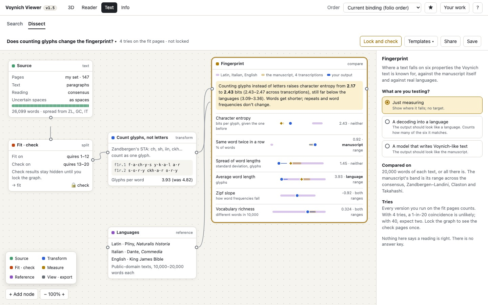

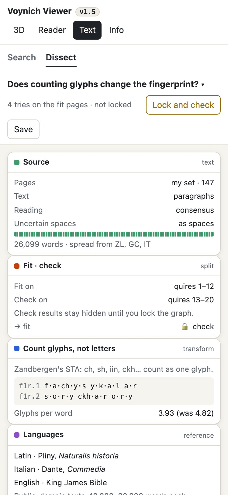

Dissect becomes a canvas where you wire steps together, as in Weavy (now Figma Weave). Each step is a node that shows
its result live, with the folios it came from, so you can see what you did, to which pages, what came out, and whether
it says anything. The whole graph lives in the URL and in Your work, so a forum post can link to exactly what was done.
On a phone the same graph folds into a list of steps, with "+ Add a step" between them.

| Node | Does | Shows |
|---|---|---|
| **Source** | pages (a page set, range, quire, section, scribe, Currier language, kind of text); reading (consensus, one transcriber, every transcriber); spaces (as transcribed, ignored, uncertain as space, no space or half); alternatives (first, all, drop) | words and pages, a strip of where they sit in the book; every token keeps its locus |
| **Fit · check** | splits the pages in two | fit results live; check results hidden until you **Lock and check** |
| **Transform** | merge glyphs (plumes, STA families, Stolfi's g = m), count STA glyphs or Eva letters, keep or drop (gallows, labels, the first word of each line), take positions, re-cut words (ignore spaces, cut by a rule), reverse, replace (regex), and **your mapping**: a table you write, glyphs to anything you like. The site ships none. | a sample with page labels, and what changed |
| **Measure** | frequencies (words, glyphs, n-grams), entropy, word lengths, Zipf, vocabulary richness, repeats, slot charts, line positions 1–5 from each end, evidence at doubtful spaces, similar words | each number with its range across transcriptions |
| **Compare** | two inputs: keyness and differences | flags any difference smaller than the spread |
| **Reference** | public-domain texts in real languages (Latin, Italian and English to start), or any saved output | |
| **Fingerprint** | where a text falls on the manuscript's known properties | below |
| **View · export** | text with links into the Reader, tables, charts; CSV, IVTFF, the graph as JSON; open in Search | |

**The fingerprint.** Six properties the Voynich text is known for. Measured on DEV pages for the consensus,
Zandbergen–Landini, Claston and Takahashi, against public-domain Latin (Pliny), Italian (Dante) and English (King James
Bible) on equal samples:

| Property | The manuscript | Latin · Italian · English | Tells them apart? |
|---|---|---|---|
| Character entropy (bits per glyph, given the one before) | 2.17–2.20 | 3.09–3.36 | yes, strongly |
| Same word twice in a row | 0.80–0.92% | 0.02–0.05% | yes, about 30× |
| Spread of word lengths (sd) | 1.78–2.02 | 1.79–2.62 | at the low edge |
| Average word length (Eva letters) | 4.74–5.11 | 3.94–5.79 | no |
| Zipf slope | −0.94 to −0.91 | −1.09 to −0.75 | no |
| Vocabulary richness (different words in 10,000) | 0.32–0.36 | 0.12–0.42 | no |

That is why the text looks like language in some ways and not in others. The numbers depend on what you count: the
mock's example graph counts Zandbergen's glyphs instead of Eva letters, which moves entropy from 2.17 to 2.43 bits,
still far from any language. A switch says **what you are testing**:
- **just measuring** (no target);
- **a decoding**, whose output should look like a language, so it counts how many of the six it matches;
- **a model** that writes Voynich-like text, whose output should look like the manuscript.

Verdicts compare ranges, not points: your output's own spread across transcriptions against each band.

**Keeping it honest**, without spoiling the fun:
- **Tries.** Every version you run on the fit pages counts: "4 tries … with 40, expect two coincidences".
- **Lock and check.** The check pages show their results once the graph is frozen. Editing afterwards marks the check
  as seen. This is your own DEV/EVAL protocol, made into a feature.
- **No answer key.** Nothing says a reading is right. Matching the fingerprint is necessary, not sufficient (the lesson
  of Heaven's Vault).

**Templates** to start from: Currier A against B; does my cipher reproduce the fingerprint?; line-initial glyphs by
scribe; test a word-break rule on the check pages; where a word clusters in Davis's order.

**Speed.** The graph runs in a Web Worker. The whole corpus is about 38,000 words, so every measure takes well under
100 ms, and the spread is the same graph run for ZL, GC and IT in parallel.

### 6.6 Settling readings (the gold set)

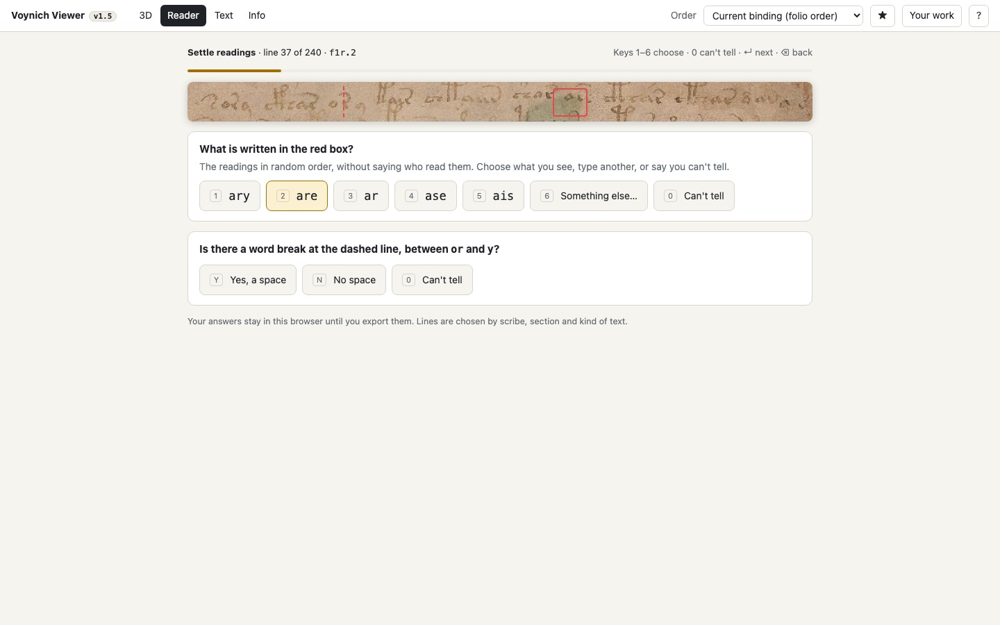

Covered in section 8.

### 6.7 Where the philologist and the designer disagreed

| Question | Philologist | Designer | Settled |
|---|---|---|---|
| What is shown by default? | every disagreement; hiding any is quietly resolving it | 7% of glyphs and 5% of gaps marked means most lines carry several marks: noise | **Mark only where the consensus itself is unsure** (plurality, tie, unreadable, uncertain gaps). Majorities are one switch away, and every word's card shows all readings. The default is stated under the text: "marks show where transcribers split". |
| Should FSG, Currier and partial transcribers vote? | yes, they are independent people | more voters makes the counts on a page jump around | They vote. The header says how many people cover each page. The gold set tests "modern three only" against it. |
| Eva in a monospace font? | needed for alignment and for counting minims | monospace looks technical to a first-time reader | Monospace for Eva everywhere (it is a code, and *iin*/*iiin* must be countable). The glyph font is the friendly face once cleared. |
| Interlinear as default? | it is the evidence | it is a wall of text | Lines are the default; interlinear is one tap, and N jumps there from any mark. |
| Ranges on every count | required | clutter | Ranges in small muted type next to each count, and dropped when all transcriptions agree ("27"). |
| A canvas of nodes for Dissect | a free canvas invites trying things until something "works" | a canvas is the clearest way to show steps, branches and provenance, and it's fun | **Canvas**, with a tries counter, Lock and check, and no answer key. On a phone it is a list of steps. |
| A node for your own letter mapping | conflicts with "never a sound value" | it's how people test decipherments, so leaving it out sends them elsewhere | **Allowed** (your decision, 7 Oct) as the visitor's own hypothesis: kept only in their graph and Your work, labelled "your mapping", never shipped or suggested by the site, no built-in mappings. |

---

## 7. Keys, links, saved work, accessibility, speed

**Keys** (all new ones are free today, checked against the ? dialog and `app.js:2036`):

| Key | Where | Does |
|---|---|---|
| T | Reader | text panel on / off (3D keeps T for turning over) |
| / | anywhere | focus the search box |
| N / Shift+N | Reader with text | next / previous disagreement, opens its card |
| I | Reader with text | lines ↔ interlinear |
| Esc | card, search | close / clear |
| ↑ ↓, Enter | results list | move, open in the Reader |

Arrows keep turning pages unless focus is in the search box. In the panel, focus moves by Tab between marked words.

**Links.**

| What | Hash |
|---|---|
| A page with text | `#read/beinecke/1r/text` |
| A line, a match and an open card | `#read/beinecke/1r/text?l=f1r.2&m=31-34&card=1` |
| A search with its narrowing chain and settings | `#text/beinecke/search?q=qok*&in=cons&sp=either&eq=eva&near=0&set=mine&steps=scribe:2;sort:right` |
| A Dissect comparison | `#text/beinecke/dissect?a=lang:A&b=lang:B&what=words` |

The order in the hash drives the book strip. Every old link resolves as today, because the fourth segment is new and
`text` is a new view.

**Saved work.** New localStorage keys, written only when you change something: `vv:text:open`, `vv:text:view`,
`vv:text:marks`, `vv:text:font`, `vv:text:sets`. Saved searches go into IndexedDB `work` under `searches`, beside
`orders` and `bookmarks`. The export becomes `version: 2` with `searches: [{id, name, hash, created}]` and
`pagesets: [...]`. Import accepts version 1 and 2. A version-1 file imports exactly as before, with no searches. A
round-trip test covers both versions.

**Accessibility.** Every mark has text ("uncertain space", "readings differ", with the counts in the card). The card
is a dialog with focus trapped and returned. The strip has a text equivalent ("hits on 31 pages; most on f75r…"). Touch
targets are at least 44 px; contrast meets AA in both themes. Glyph-font text carries its Eva. The Info page gains
"Reading the text", written for a curious 15-year-old: what a transcription is, why Eva letters are names for shapes
and not sounds, and what "consensus" means here.

---

## 8. Gold set and benchmarks

### 8.1 Accuracy against the photographs (comes first)

- **Lines.** 240 lines, from **DEV pages only**, which covers every section and all five scribes. They are stratified
  by scribe × kind of text (paragraph, label, ring, radius). Known hard places are always included: f1r, f57v, f116v,
  the zodiac labels on DEV pages, and Rosettes lines. Contested lines are over-sampled, since unanimous ones say
  little about method. Results are re-weighted to the whole text by sampling probability.
- **What you judge.** Only the places where at least one source differs: any voter, RF1, voynichese.com or Zattera's
  rule. A check of 200 unanimous glyphs tests the assumption that unanimous means right.
- **The screen** (mock 6.6) shows a crop of Yale's full-size photograph around the line, with the place boxed. Below
  it are the competing readings in random order, with no names, plus *something else* and *can't tell*, and for gaps
  *space / no space / can't tell*. Keys 1–6, 0, Enter, Backspace. Answers stay in your browser until exported. A
  second judge's file gives agreement between judges (Cohen's κ).
- **Crops before PR 2.** Line boxes come from voynichese.com's word boxes, fitted to Yale's images per page (PR 2).
  Until then the screen asks you to drag once around the line (about 2 s a line), and those boxes are kept.
- **Scoring.** Glyph error and space error (false splits and missed splits separately), overall and per scribe, with
  bootstrap 95% intervals over lines. Sources: consensus, ZL, GC, IT, VT0e, RF1 and Zattera's rule.
- **No peeking.** The three rule variants are chosen on half the gold set and reported on the other half, then the
  rule is frozen.
- **Pass.** The consensus beats every single transcription, and voynichese.com with non-overlapping intervals.
  If it does not beat RF1, the doc says so and RF1's rule is considered.

### 8.2 The other benchmarks

- **Coverage**: all 5,385 loci appear, each with its number of witnesses, the Rosettes included; known gaps are
  listed (3.5).
- **Known numbers**, automated in `tools/text/tests`: loci by type, about 38,000 word tokens, the ZL/IT agreement
  (97.9% of glyphs, 61% of lines, 86% of words, 95.2% of breaks where glyphs match), and Lindemann & Bowern's
  character entropy under the same alphabet. Each must fall within the spread across transcriptions.
- **Ten tasks**, timed without help, against voynichese.com and grep on the IVTFF files:
  1. Every word starting *qok* on scribe 2's pages, and how they spread across sections.
  2. Words found only in labels.
  3. Line-initial glyphs in Currier A against B.
  4. Near-repeats of a word within three lines.
  5. Is a reading a decipherment depends on contested? Look at the photograph.
  6. A sequence however transcribers split it (*chol daiin* / *choldaiin*).
  7. Where a word falls in Davis's order against the binding.
  8. The first word of every paragraph on f75r–f84v.
  9. How many uncertain spaces f57v has, and who doubted them.
  10. Export every *daiin* with its locus to CSV.
- **Speed**: index ready in 1 s and a query answered in 50 ms on a throttled mid-range phone; a page's text no
  slower than its photograph.

---

## 9. Against the field

V: used or read the tool's own page; S: secondary source. Checked 7 Oct 2026.

| | **Text** (planned) | voynichese.com | voynich.ninja corpus | IVTT online | Voyager | AntConc / Sketch Engine | SigLA | Archetype |
|---|---|---|---|---|---|---|---|---|
| Transcriptions | 13 people + RF1, VT; consensus | 1 (Takahashi) V | 3, one at a time V | 7, one at a time V | none V | any file S | n/a | n/a |
| Uncertain spaces, alternatives | shown, votable, searchable | no | no V | as output options V | no | no | damaged signs V | n/a |
| Disagreement / consensus | interlinear, card, consensus | no | no; LSI pooled (counts ×3.4) V | pick one transcriber V | no | no | no | no |
| Text beside the photograph | yes; boxes in PR 2 | boxes, **no text** V | no | no | photo only V | no | traced signs V | glyph clips S |
| Rosettes, all loci | yes | no V | 2017 LZ file V | yes V | photo | | | |
| Query | words to regex, classes, positions, joiners, near | `*` `^` `$` V | prefix, suffix, basic regex V | none V | | regex, CQL S | sign sequences V | allograph S |
| Filters | scribe, language, section, quire, kind, page set | A/B V | folio regex V | illustration, language, hand, locus type V | quire V | if encoded | site, type V | hand S |
| Results | KWIC, facets with ranges, strip in any order | thumbnails V | type list V | text box V | | KWIC, plot V | crops V | grid S |
| Statistics | Dissect (PR 3) | per folio chart S | counts | | | lists, keyness V | frequency V | |
| Shareable URL / export | full chain / CSV, IVTFF, loci | yes / no V | yes / no V | no / download V | yes V | n/a | ? | |
| Phone | yes | no V | no V | yes V | no V | no | no V | no |

Nothing else shows the disagreements, takes uncertain spaces into queries, or plots hits in a proposed page order.

---

## 10. Plan

You ship in weekly sprints, with each feature on its own branch so it can be dropped (memory). The prompt asks for
What's new lines "in the same commit"; your sprint rule puts the version and changelog in the sprint's release
commit instead. I'll follow the sprint rule unless you say otherwise.

**Phase 2: data** (branch `glyph-text`): `tools/text/` pipeline and tests, `data/text/*`, and the diff report against
VT0e and RF1 (where, how many, which direction). **I show you the report before any interface work.**

**PR 1, Text: read and search** (draft PR after Phase 3):
- the data;
- the Reader text panel with quiet marks, the card and the interlinear;
- page facts and credits;
- the Text tab with Search (all of section 5 except the near-match costs, which ship with a default matrix), facets
  with ranges, the book strip in any order, results, and stepping through hits in the Reader;
- export, saved searches, export v2 with migration;
- Info "Reading the text";
- keys, links and tests (on the test kit from `test-kit-merged`, own port).

The glyph font (Voynich VV, built and tested in `tools/font/`) ships in PR 1 with the Eva / Glyphs switch.

**PR 2, text on the photograph**: voynichese.com's boxes fitted to Yale's images per page. Hover a word and it lights
up on the page, and the other way round. Line crops in the card, gap widths at doubtful spaces (and a check of the
Rozanova & Temerev result on our own data), and the gold-set screen with real crops. Then the accuracy results.

**PR 3, Dissect**: the workbench of nodes and the fingerprint (6.5).

**Later**: the glyph atlas (crops grouped by scribe, Archetype style); the notebook (your glosses over every
occurrence, confidence 0–3, never "correct"); checking readings (reports tied to a locus, and your verdicts as a new
credited witness); asking Zandbergen for his RF1 word boxes (your call).

---

## 11. Decisions I need from you

1. ~~The glyph font~~: settled. Claston's font ships as Voynich VV (6.1a), with all its rare forms drawn.
2. **CC0 for derived files.** voynich.nu's CC0 statement covers republishing as JSON as I read it. Do you want
   Zandbergen told or asked anyway, for courtesy and for the credit line's wording?
3. **Who votes.** The default is every independent person (13), equal votes, with a written tie rule. The gold set
   will test "the modern three only" and "RF1 breaks ties". Agree?
4. **Gold set from DEV pages only.** This keeps your protocol intact, and DEV covers every section and scribe. Agree,
   and are 240 lines (about 3 hours of judging) the right size? Will anyone judge with you?
5. **Changelog timing**: the sprint rule (version and What's new in the release commit) over the prompt's "same
   commit"?
6. ~~The mocks and your split~~: settled. The Search mock is rebuilt from the whole book; no mock lists or hints at
   which pages are held out.
7. **Dark mode.** The mocks propose dark tokens for the chrome, because the prompt asks for dark. Should Text ship
   with site-wide dark mode (`prefers-color-scheme`), or stay light like the rest of the site for now?
8. ~~Your own mapping in Dissect~~: allowed, as the visitor's own labelled hypothesis (6.5, 6.7).
9. **Language references.** I'd start with public-domain texts: Pliny (Latin), Dante (Italian), the King James Bible
   (English). Your research repo also has CC BY Leipzig corpora in many languages; they need a credit line. Which
   languages matter most to you: German, Occitan, Czech, Hebrew?
